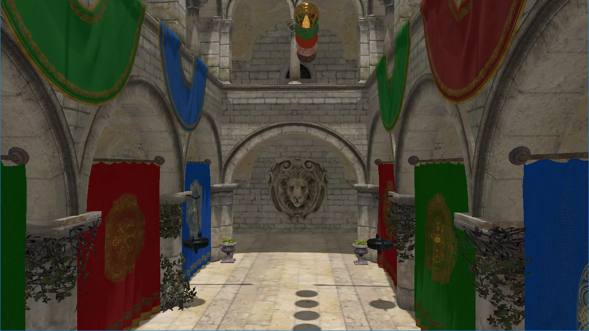

## Low-level graphics api
This api is written in C++ on top of Directx 12 and Vulkan. Provides main features but hide some details.

* Supported features
  * Ray Tracing
  * Bindless
  * Variable rate shading (DX12 only)
  * Per command list resource state tracking
    * Creating patch command list for sync with global resource state on execute
  * HLSL as shader language for all backends
    * Compilation in DXBC, DXIL, SPIRV

* Planned features
  * Mesh shading (need investigation)
  * DX11/OpenGL were available on [commit](https://github.com/andrejnau/FlyCube/tree/9756f8fae2530a635302c549694374206c886b5c), not sure if these api really needs

* Platforms
  * Windows 10
  
### Low-level graphics api example
```cpp
Settings settings = ParseArgs(argc, argv);
AppBox app("Example", settings);
AppRect rect = app.GetAppRect();

std::shared_ptr<Instance> instance = CreateInstance(settings.api_type);
std::shared_ptr<Adapter> adapter = std::move(instance->EnumerateAdapters()[settings.required_gpu_index]);
std::shared_ptr<Device> device = adapter->CreateDevice();

constexpr uint32_t frame_count = 3;
std::shared_ptr<Swapchain> swapchain = device->CreateSwapchain(app.GetWindow(), rect.width, rect.height, frame_count, settings.vsync);

std::vector<uint32_t> index_data = { 0, 1, 2 };
std::shared_ptr<Resource> index_buffer = device->CreateBuffer(BindFlag::kIndexBuffer, sizeof(uint32_t) * index_data.size(), MemoryType::kUpload);
index_buffer->UpdateUploadData(index_data.data(), 0, sizeof(index_data.front()) * index_data.size());

std::vector<glm::vec3> vertex_data = { glm::vec3(-0.5, -0.5, 0.0), glm::vec3(0.0,  0.5, 0.0), glm::vec3(0.5, -0.5, 0.0) };
std::shared_ptr<Resource> vertex_buffer = device->CreateBuffer(BindFlag::kVertexBuffer, sizeof(vertex_data.front()) * vertex_data.size(), MemoryType::kUpload);
vertex_buffer->UpdateUploadData(vertex_data.data(), 0, sizeof(vertex_data.front()) * vertex_data.size());

glm::vec4 constant_data = glm::vec4(1, 0, 0, 1);
std::shared_ptr<Resource> constant_buffer = device->CreateBuffer(BindFlag::kConstantBuffer, sizeof(constant_data), MemoryType::kUpload);
constant_buffer->UpdateUploadData(&constant_data, 0, sizeof(constant_data));

ViewDesc constant_view_desc = {};
constant_view_desc.view_type = ViewType::kConstantBuffer;
std::shared_ptr<View> constant_buffer_view = device->CreateView(constant_buffer, constant_view_desc);
std::shared_ptr<Shader> vertex_shader = device->CompileShader({ "shaders/Triangle/VertexShader_VS.hlsl", "main", ShaderType::kVertex, "6_0" });
std::shared_ptr<Shader> pixel_shader = device->CompileShader({ "shaders/Triangle/PixelShader_PS.hlsl", "main",  ShaderType::kPixel, "6_0" });
std::shared_ptr<Program> program = device->CreateProgram({ vertex_shader, pixel_shader });
std::shared_ptr<BindingSet> binding_set = program->CreateBindingSet({ { pixel_shader->GetBindKey("Settings"), constant_buffer_view } });
GraphicsPipelineDesc pipeline_desc = {
    program,
    { { 0, "POSITION", gli::FORMAT_RGB32_SFLOAT_PACK32, sizeof(vertex_data.front()) } },
    { { 0, swapchain->GetFormat() } },
};
std::shared_ptr<Pipeline> pipeline = device->CreateGraphicsPipeline(pipeline_desc);

std::vector<std::shared_ptr<CommandList>> command_lists;
std::vector<std::shared_ptr<View>> views;
std::vector<std::shared_ptr<Framebuffer>> framebuffers;
for (uint32_t i = 0; i < frame_count; ++i)
{
    std::shared_ptr<Resource> back_buffer = swapchain->GetBackBuffer(i);
    ViewDesc back_buffer_view_desc = {};
    back_buffer_view_desc.view_type = ViewType::kRenderTarget;
    std::shared_ptr<View> back_buffer_view = device->CreateView(back_buffer, back_buffer_view_desc);
    framebuffers.emplace_back(device->CreateFramebuffer(pipeline, rect.width, rect.height, { back_buffer_view }));
    command_lists.emplace_back(device->CreateCommandList());
    std::shared_ptr<CommandList> command_list = command_lists[i];
    command_list->Open();
    command_list->ResourceBarrier({ { back_buffer, ResourceState::kClearColor} });
    command_list->ClearColor(back_buffer_view, { 0.0, 0.2, 0.4, 1.0 });
    command_list->ResourceBarrier({ { back_buffer, ResourceState::kRenderTarget} });
    command_list->BindPipeline(pipeline);
    command_list->BindBindingSet(binding_set);
    command_list->BeginRenderPass(framebuffers.back());
    command_list->SetViewport(rect.width, rect.height);
    command_list->IASetIndexBuffer(index_buffer, gli::format::FORMAT_R32_UINT_PACK32);
    command_list->IASetVertexBuffer(0, vertex_buffer);
    command_list->DrawIndexed(3, 0, 0);
    command_list->EndRenderPass();
    command_list->ResourceBarrier({ { back_buffer, ResourceState::kPresent} });
    command_list->Close();
}

std::array<uint64_t, frame_count> fence_values = {};
uint64_t fence_value = 0;
std::shared_ptr<Fence> fence = device->CreateFence(fence_value);

while (!app.PollEvents())
{
    uint32_t frame_index = swapchain->NextImage(fence, ++fence_value);
    device->Wait(fence, fence_value);
    fence->Wait(fence_values[frame_index]);
    device->ExecuteCommandLists({ command_lists[frame_index] });
    device->Signal(fence, fence_values[frame_index] = ++fence_value);
    swapchain->Present(fence, fence_values[frame_index]);
    app.UpdateFps(adapter->GetName());
}
device->Signal(fence, ++fence_value);
fence->Wait(fence_value);
```

## High-level graphics api and utilities
A set of classes simplifying the writing of complex scenes.

* High-level api features
  * Automatic resource state tracking
  * Generated shader helper by shader reflection
    * Easy to use resources binding
    * Constant buffers proxy for compile time access to members

* Utilities features
  * Application skeleton
    * Window creating
    * Keyboard/Mouse events source
  * Camera
  * Geometry utils
    * 3D models loading with assimp
  * Texture utils
    * Images loading with gli and SOIL
   
### High-level graphics api example
```cpp
Settings settings = ParseArgs(argc, argv);
AppBox app("Triangle", settings);

Context context(settings, app.GetWindow());
Device& device(*context.GetDevice());
AppRect rect = app.GetAppRect();
ProgramHolder<PixelShaderPS, VertexShaderVS> program(device);

std::shared_ptr<CommandListBox> upload_command_list = context.CreateCommandList();
upload_command_list->Open();
std::vector<uint32_t> ibuf = { 0, 1, 2 };
std::shared_ptr<Resource> index = device.CreateBuffer(BindFlag::kIndexBuffer | BindFlag::kCopyDest, sizeof(uint32_t) * ibuf.size());
upload_command_list->UpdateSubresource(index, 0, ibuf.data(), 0, 0);
std::vector<glm::vec3> pbuf = {
    glm::vec3(-0.5, -0.5, 0.0),
    glm::vec3(0.0,  0.5, 0.0),
    glm::vec3(0.5, -0.5, 0.0)
};
std::shared_ptr<Resource> pos = device.CreateBuffer(BindFlag::kVertexBuffer | BindFlag::kCopyDest, sizeof(glm::vec3) * pbuf.size());
upload_command_list->UpdateSubresource(pos, 0, pbuf.data(), 0, 0);
upload_command_list->Close();
context.ExecuteCommandLists({ upload_command_list });

program.ps.cbuffer.Settings.color = glm::vec4(1, 0, 0, 1);

std::vector<std::shared_ptr<CommandListBox>> command_lists;
for (uint32_t i = 0; i < Context::FrameCount; ++i)
{
    decltype(auto) command_list = context.CreateCommandList();
    command_list->Open();
    command_list->UseProgram(program);
    command_list->Attach(program.ps.cbv.Settings, program.ps.cbuffer.Settings);
    command_list->SetViewport(rect.width, rect.height);
    command_list->Attach(program.ps.om.rtv0, context.GetBackBuffer(i));
    command_list->ClearColor(program.ps.om.rtv0, { 0.0f, 0.2f, 0.4f, 1.0f });
    command_list->IASetIndexBuffer(index, gli::format::FORMAT_R32_UINT_PACK32);
    command_list->IASetVertexBuffer(program.vs.ia.POSITION, pos);
    command_list->DrawIndexed(3, 0, 0);
    command_list->Close();
    command_lists.emplace_back(command_list);
}

while (!app.PollEvents())
{
    context.ExecuteCommandLists({ command_lists[context.GetFrameIndex()] });
    context.Present();
    app.UpdateFps(context.GetGpuName());
}
context.WaitIdle();
```

## SponzaPbr

* Scene Features
  * Deferred rendering
  * Physically based rendering
  * Image based lighting
  * Ambient occlusion
    * Raytracing
    * Screen space
  * Normal mapping
  * Point shadow mapping
  * Skeletal animation
  * Multisample anti-aliasing
  * Tone mapping
  * Simple imgui based UI settings



### SponzaPbr Settings
Press Tab to open settings menu

## Build
```
python init.py
mkdir build
cd build
cmake -G "Visual Studio 16 2019" -Ax64 ..
cmake --build . --config RelWithDebInfo
```

## Setup for Vulkan
Use Vulkan SDK 1.2.141
